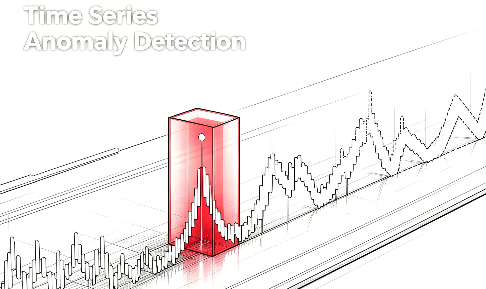
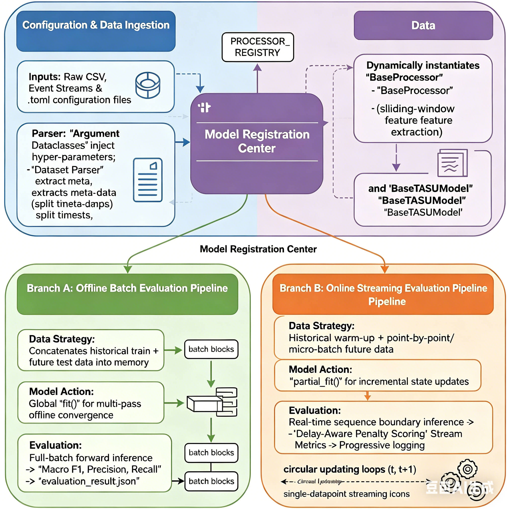
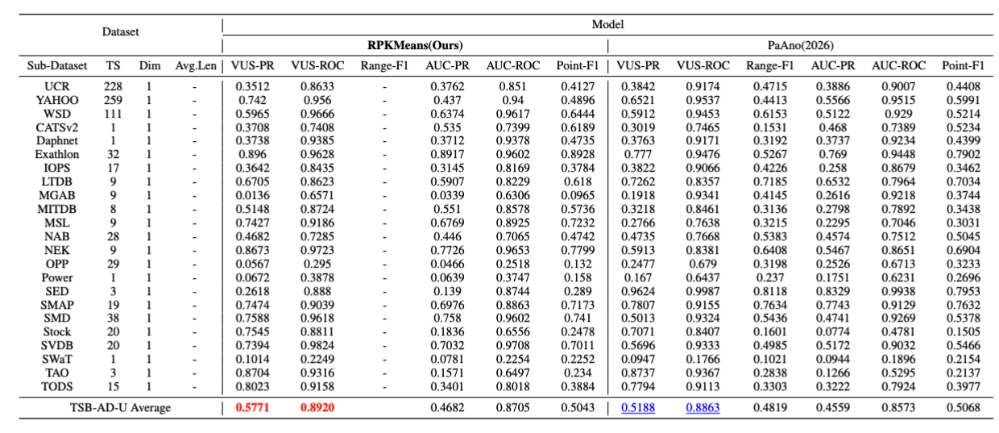

<h1 align="center">TSAD</h1>
<h2 align="center">Not a Toy: Comprehensive Anomaly Detection for Time Series </h2>

 
<!-- -->

Starting from the **online anomaly detection** requirements for real-world event sequences, we revisit existing detection paradigms and benchmarks. Real-world event streams are marked by high throughput, low latency, and continuously changing distributions — traditional offline batch evaluation fails to fully reflect model performance in online scenarios.

Our project focuses on addressing this gap, with the following goals:

* 🎯 **Core Requirements Definition**: Clarify key metrics for streaming anomaly detection — online inference latency, throughput, anomaly detection capability, and delayed alerting performance.
* 📐 **Evaluation Protocol Redesign**: Adopt event-based online scoring (accounting for detection latency & false alarm costs), sliding window with rolling calibration, and latency-sensitive precision/recall metrics.
* 🧪 **Reproducible Baselines**: Provide data preparation scripts, real event sequence samples from \`data/TSB-AD-U\`, and standardized online train/test splitting strategies.
* ⚡ **Lightweight Evaluator**: Release a streamlined streaming evaluator for end-to-end evaluation in real engineering pipelines (jointly measuring latency, throughput, and accuracy).

<h2 align="center">Framework</h2>
Our Framework is like:

Our framework is highly modular and designed to seamlessly bridge the gap between traditional offline evaluation and real-world streaming deployments. It consists of three core decoupled components:

1. 🛠️ **Configuration & Data Ingestion**:

   - Leverages `.toml` files and Python `dataclasses` for rigid, reproducible hyper-parameter injection.
   - Automatically parses dataset metadata (e.g., train/test split timestamps) and converts raw event streams into standardized structured formats.
2. 🧩 **Model Registration Center (The Central Hub)**:

   - Inspired by the Hugging Face `AutoModel` paradigm, it features a plug-and-play architecture with `PROCESSOR_REGISTRY` and `MODEL_REGISTRY`.
   - Dynamically binds the appropriate data preprocessor (for on-the-fly sliding-window feature extraction) with the core algorithmic base.
3. 🛤️ **Dual Evaluation Pipelines**:

   - **Offline Batch Pipeline (Baseline)**: Evaluates models using static, whole-dataset processing with global convergence and standard global metrics.
   - **Online Streaming Pipeline (Proposed)**: Simulates real-world continuous data arrival. Models undergo incremental state updating, and performance is measured using our customized **Delay-Aware Streaming Metrics** to actively penalize late detections.

<h2 align="center">A  Baseline</h2>
We propose Residual Multi-Period KMeans (RPKMeans) as a powerful baseline, which achieves SOTA performance on the static TSB-AD-U and outperforms full-shot deep models in the field, as well as zshort and fine-tuned pre-trained models.

